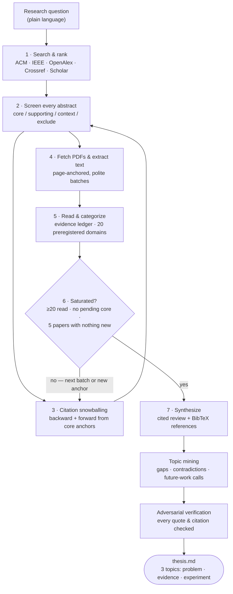

# PhD Dissertation Research — Multi-Agent LLM Software Development

**Student:** Dave Seepersad · **Program:** Ph.D. in Computer Science, Nova Southeastern University
**Stage:** Idea Paper preparation (topic selection from a completed systematic literature review)

This repository contains the tooling, artifacts, and results of a systematic
literature review on **multi-agent LLM systems for software development**, and
the three evidence-grounded dissertation topic candidates derived from it.

**Start here:**
[results/20260830-specialized-multi-agent-versus-single-ag/thesis.md](results/20260830-specialized-multi-agent-versus-single-ag/thesis.md)
— the three strongest topics, each with a literature-supported problem
statement, verbatim page-anchored evidence, a proposed controlled experiment,
and the published evidence that the approach is viable.

Every topic exploration is **self-contained under `results/<run>/`** — its
search logs, screening decisions, corpus, `thesis.md`, and the rendered
advisor-review Word document all live in one folder, so multiple candidate
topics can be explored and compared side by side.

---

## A note on method, for my advisor

The research workflow in this repository is **my design**: the pipeline stages,
the screening criteria, the citation-chaining strategy, the saturation stopping
rule, and the verification requirements were specified by me and encoded as a
reusable, auditable process. **AI agents automate the execution** of that
process — the high-volume mechanical work of searching five databases, fetching
and extracting hundreds of documents, triaging abstracts, taking structured
notes, and cross-checking quotations. Every judgment the automation makes is
written to a JSON artifact that I can inspect, correct, and re-run, so the
entire review is reproducible and auditable end to end.

**The dissertation itself will be written by me, without AI-generated prose.**
The automation produces working materials — reading queues, evidence ledgers,
citation maps, and candidate problem statements — that I use the way any
researcher uses a well-organized filing system. Per NSU's Certification of
Authorship, the use of this tooling will be disclosed in every submitted
document.

## Repository contents

| Path | What it is |
|---|---|
| [results/20260830-.../thesis.md](results/20260830-specialized-multi-agent-versus-single-ag/thesis.md) | **Final output of the first run:** top 3 dissertation topics with problems, evidence, experiments, and references (plus its rendered `.docx` beside it) |
| [.github/skills/publications-search/](.github/skills/publications-search/) | The literature-review pipeline ("the Skill"): 15 Python scripts + agent instructions ([SKILL.md](.github/skills/publications-search/SKILL.md)) |
| [.github/skills/topic-ideation/](.github/skills/topic-ideation/) | Topic-ideation skill: OpenAlex/arXiv landscape scanner + PhD-worthiness rubric for evaluating alternative dissertation topics across the agentic/generative-AI space |
| [.github/skills/publications-search/REVIEW.md](.github/skills/publications-search/REVIEW.md) | Independent audit of the pipeline against SLR standards (Kitchenham, PRISMA 2020, Wohlin) and NSU's dissertation guide — implemented 2026-09-03 |
| [tools/render_thesis_docx.py](tools/render_thesis_docx.py) | Renders any run's `thesis.md` into the NSU-formatted advisor-review Word document |
| `results/<date>-<topic>/` | One self-contained folder per review run: search logs, screening decisions, citation edges, PDFs, extracted text, evidence notes, `thesis.md`, and its `.docx` (PDFs are licensed to me personally) |
| `results/<date>-ideation-<areas>/` | One folder per topic-ideation scan: `landscape.json`/`landscape.md` and the ranked `ideas.md` |
| [dissertation-guide.pdf](dissertation-guide.pdf) | NSU dissertation guide the process is aligned to |

## How the topics were created

**Phase 1 — Retrieval.** The Skill was first used to search five sources in
parallel — the **ACM Digital Library** and **IEEE Xplore** (through my own
institutional sign-in; the tooling never bypasses access controls), plus
OpenAlex, Crossref, and Google Scholar. Results were merged, de-duplicated by
DOI, and ranked by a transparent formula favoring relevance and recency, giving
a prioritized reading queue rather than a black-box cut-off: **every candidate
abstract was screened** (522 records in the final run).

**Phase 2 — Corpus building and mapping.** As screened papers accumulated, a
workflow emerged on top of retrieval: papers judged *core* became anchors for
**citation snowballing** — walking both backward (their references) and forward
(papers citing them) — with every citation edge recorded (which anchor, which
direction), producing a citation-linking map of the field. Full texts were
fetched in polite batches and converted to page-anchored text. Each paper read
was **categorized in an evidence ledger**: its research design, controls,
headline results, and limitations, with its concepts mapped to 20 pre-registered
evidence domains. Reading stopped only when a defensible saturation rule was
met: at least 20 full texts, no unread core papers, and five consecutive papers
contributing no new evidence domain. The final run read **48 papers in full**.

**Phase 3 — Topic identification.** With the corpus normalized into structured
notes, the evidence was mined for recurring, unresolved problems: contradictory
findings, confounded comparisons, and gaps the papers' own authors name as
future work. Candidate topics were drafted around the strongest gaps, an
independent adversarial sweep of all 48 papers confirmed no stronger topic was
missed, and each candidate's supporting quotations were **independently
verified** — exact substring match against the extracted paper text, page
numbers checked, author/venue metadata corrected against each paper's first
page. The three survivors, with their proposed experiments, are in
[thesis.md](thesis.md).

## The Skill's workflow

### What each step does

| Step | Who / tool | Input → Output | Purpose |
|---|---|---|---|
| 1. Search & rank | `search.py` (scripts) | Research question → `candidates.json` | Query all five sources, merge and de-duplicate by DOI, rank by relevance/citations/recency so the best candidates are read first |
| 2. Screen abstracts | Me + AI triage (`screen.py`) | Every abstract → `screening.json` | Judge each abstract against the research question: **core** (must read), **supporting**, **context**, or **exclude** — with a written rationale per decision |
| 3. Snowball citations | `snowball.py` | Core anchors → expanded `candidates.json`, `snowball-round-NN.json` | Follow references (backward) and citing papers (forward) from the strongest papers; each edge is recorded, forming the citation map; new hits return to step 2 |
| 4. Fetch & extract | `fetch_pdfs.py`, `extract.py` | Selected papers → `pdfs/`, `text/` with `[[page N]]` markers | Retrieve full texts (institutional session for ACM/IEEE), convert to text where every passage can be traced to a page |
| 5. Read & categorize | AI reading under my rubric (`saturation.py`) | Full texts → `evidence-ledger.json` | Structured notes per paper: design, controls, results, limitations; concepts mapped to 20 fixed evidence domains |
| 6. Saturation check | `saturation.py check` | Ledger → `saturation-report.json` | Auditable stopping decision: ≥20 papers read, zero pending core papers, five consecutive reads adding no new domain |
| 7. Synthesize | AI draft from ledger + my review | Ledger + `manifest.json` → review, `references.bib` | Cited synthesis where every quote carries author, year, and page; BibTeX for reference management |
| 8. Topic mining | Evidence analysis | Ledger + full texts → candidate topics | Surface the strongest gaps: contradictory results, confounded comparisons, explicitly named future work |
| 9. Verification | Independent AI checkers | Candidate topics → verified topics | Every quotation re-matched byte-for-byte against `text/`, pages re-checked, citations corrected against paper first pages |
| 10. Final output | [thesis.md](thesis.md) | Verified topics → 3 dissertation candidates | Problem statement, evidence with references, proposed experiment, and viability evidence — structured to feed the NSU Idea Paper |

## Final-run numbers (2026-08-30)

| Funnel stage | Count |
|---|---|
| Records identified & screened | 522 |
| Selected (core + supporting + context) | 207 |
| Full texts read to saturation | 48 (39 core, 9 supporting) |
| Evidence domains tracked | 20 (preregistered) |
| Dissertation topics delivered | 3 (+1 documented runner-up) |

## Roadmap

- [x] Literature review pipeline built and audited ([REVIEW.md](.github/skills/publications-search/REVIEW.md))
- [x] Saturated review of multi-agent vs. single-agent LLM software development
- [x] Topic candidates with verified evidence ([thesis.md](results/20260830-specialized-multi-agent-versus-single-ag/thesis.md))
- [x] Pipeline improvements from the audit (citation-metadata fixes, PRISMA logging, protocol preregistration, quality assessment, corpus search, human-validation kappa)
- [x] Per-run containment: each run carries its own `thesis.md` + rendered docx
- [x] Topic-ideation skill for scanning the wider agentic/generative-AI landscape
- [ ] Ideation sweep across candidate topic areas; compare against the current topic
- [ ] Select topic with advisor and author the Dissertation Idea Paper (my writing; future tense per NSU guide)
- [ ] Dissertation Proposal → controlled experiment → Dissertation Report
