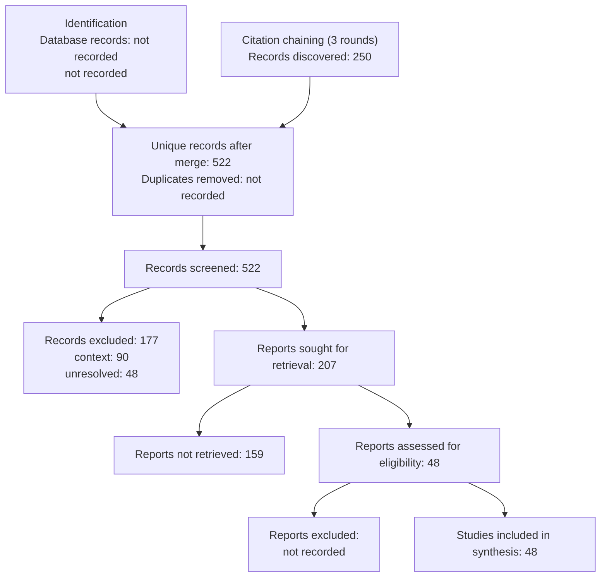

# PRISMA 2020 Flow — specialized multi-agent versus single-agent LLM software engineering: comparative performance, coordination failures, verification, reliability, sustainability, and future work

Generated 2026-09-04 from persisted run artifacts only.

| Phase | Measure | Value |
|---|---|---|
| Identification | Search runs | not recorded |
| Identification | Database records (raw) | not recorded |
| Identification | Sources used | openalex, crossref, scholar, acm, ieee |
| Identification | Citation-chaining records | 250 |
| Identification | Unique records after merge | 522 |
| Deduplication | Duplicates removed | not recorded |
| Screening | Records screened | 522 |
| Screening | Decisions | context: 90, core: 44, exclude: 177, supporting: 163, unresolved: 48 |
| Retrieval | Reports sought | 207 |
| Retrieval | Reports retrieved | 48 |
| Full-text | Reports assessed | 48 |
| Full-text | Excluded with reasons | not recorded |
| Included | Studies in synthesis | 48 |

## Not recorded

- No fulltext-exclusions.json; full-text exclusions (if any) were not recorded.
- Per-source hit counts were not persisted (no usable search-log.json).
- Duplicate-removal counts were not persisted (no dedup-log.json).
