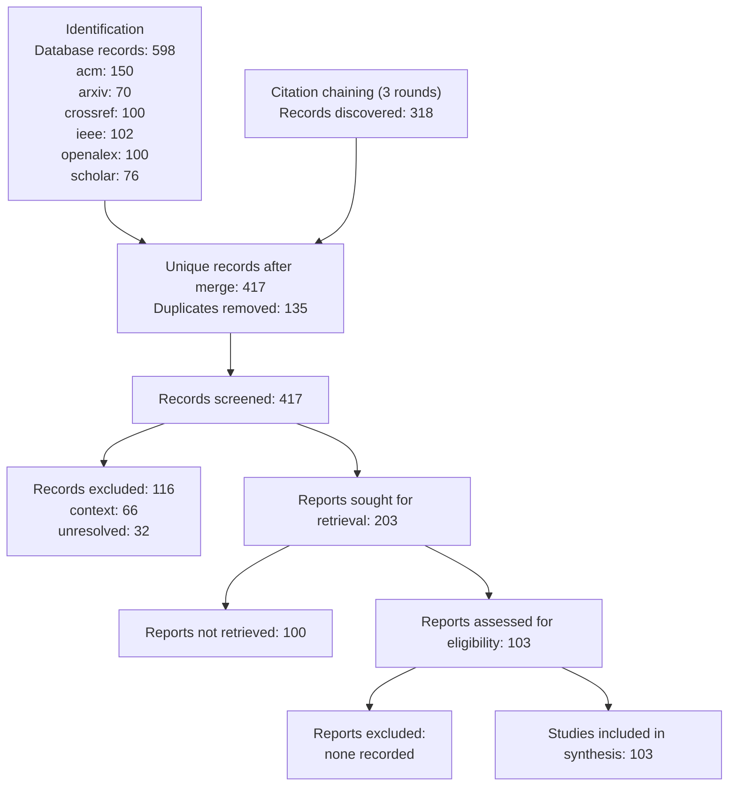

# PRISMA 2020 Flow — specialized multi-agent versus single-agent LLM software engineering: comparative performance, coordination failures, verification, reliability, sustainability, and future work

Generated 2026-09-05 from persisted run artifacts only.

| Phase | Measure | Value |
|---|---|---|
| Identification | Search runs | 4 |
| Identification | Database records (raw) | 598 |
| Identification | Sources used | acm, arxiv, crossref, ieee, openalex, scholar |
| Identification | Citation-chaining records | 318 |
| Identification | Unique records after merge | 417 |
| Deduplication | Duplicates removed | 135 |
| Screening | Records screened | 417 |
| Screening | Decisions | context: 66, core: 73, exclude: 116, supporting: 130, unresolved: 32 |
| Retrieval | Reports sought | 203 |
| Retrieval | Reports retrieved | 103 |
| Full-text | Reports assessed | 103 |
| Full-text | Excluded with reasons | none recorded |
| Included | Studies in synthesis | 103 |
