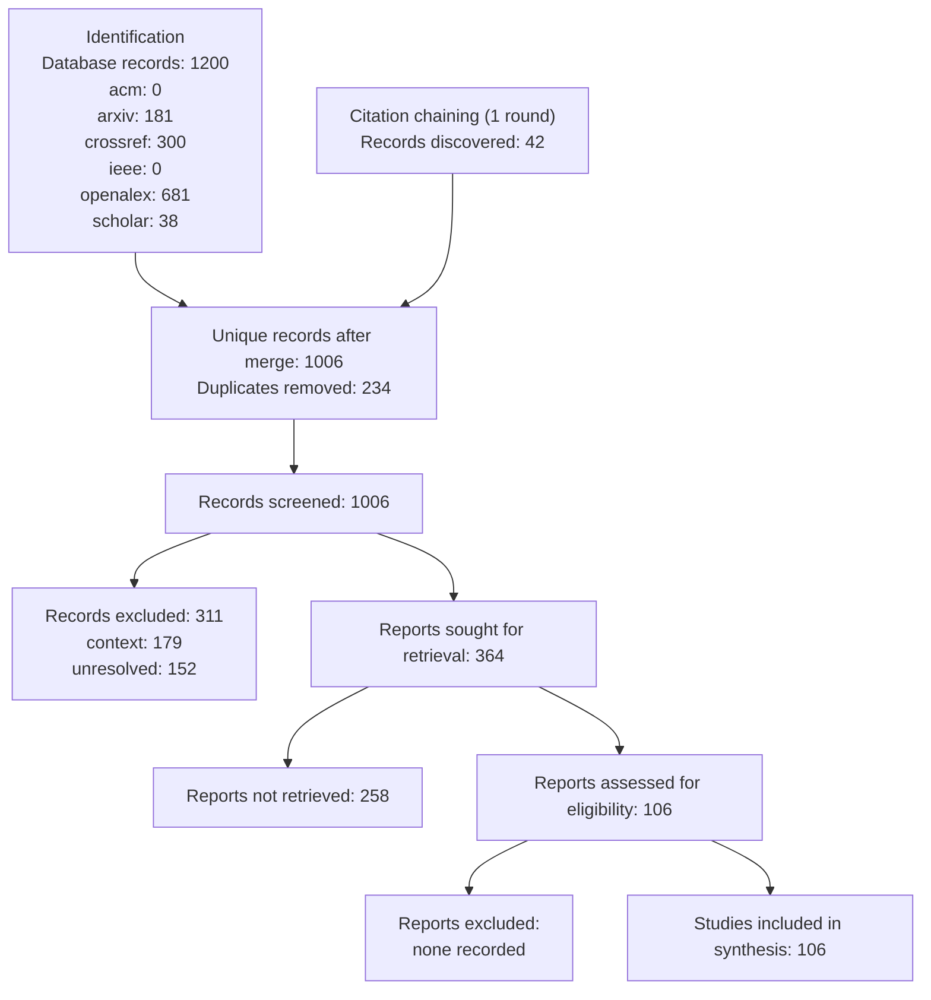

# PRISMA 2020 Flow — agent harness as a confounding variable in LLM agent performance comparisons

Generated 2026-09-05 from persisted run artifacts only.

| Phase | Measure | Value |
|---|---|---|
| Identification | Search runs | 6 |
| Identification | Database records (raw) | 1200 |
| Identification | Sources used | acm, arxiv, crossref, ieee, openalex, scholar |
| Identification | Citation-chaining records | 42 |
| Identification | Unique records after merge | 1006 |
| Deduplication | Duplicates removed | 234 |
| Screening | Records screened | 1006 |
| Screening | Decisions | context: 179, core: 117, exclude: 311, supporting: 247, unresolved: 152 |
| Retrieval | Reports sought | 364 |
| Retrieval | Reports retrieved | 106 |
| Full-text | Reports assessed | 106 |
| Full-text | Excluded with reasons | none recorded |
| Included | Studies in synthesis | 106 |

## Not recorded

- Full-text exclusions derived from evidence-ledger.json (0 excluded after assessment); write fulltext-exclusions.json to override.
