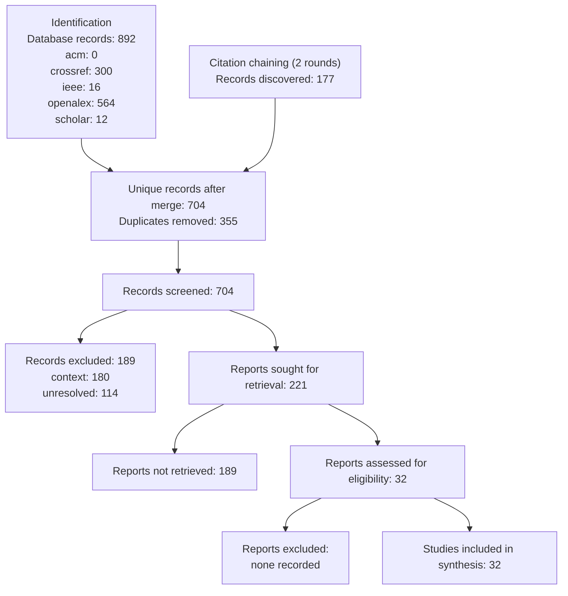

# PRISMA 2020 Flow — process model constraints versus natural language policy for compliance critical LLM business process agents

Generated 2026-09-05 from persisted run artifacts only.

| Phase | Measure | Value |
|---|---|---|
| Identification | Search runs | 8 |
| Identification | Database records (raw) | 892 |
| Identification | Sources used | acm, crossref, ieee, openalex, scholar |
| Identification | Citation-chaining records | 177 |
| Identification | Unique records after merge | 704 |
| Deduplication | Duplicates removed | 355 |
| Screening | Records screened | 704 |
| Screening | Decisions | context: 180, core: 47, exclude: 189, supporting: 174, unresolved: 114 |
| Retrieval | Reports sought | 221 |
| Retrieval | Reports retrieved | 32 |
| Full-text | Reports assessed | 32 |
| Full-text | Excluded with reasons | none recorded |
| Included | Studies in synthesis | 32 |

## Not recorded

- Full-text exclusions derived from evidence-ledger.json (0 excluded after assessment); write fulltext-exclusions.json to override.
